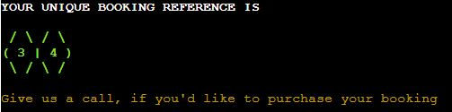

<h1>Overview</h1>
Travelbooka is a program using "do it yourself" philosophy to allow users to create their own travel package based on
parameters stored in Google sheets. Program was created for educational purposes, but in real world could be used by a travel agency to allow user to 
mix and match flight and hotel offers to create their own unique bookings.  

[View live website here](https://travelbooka.herokuapp.com/) 
[View Google sheet with data here](https://docs.google.com/spreadsheets/d/1dK4-eRQH35rCdli_3GxEjlyvN_XVsrNil5q2Ew-VxaM/edit?usp=sharing)

<h1>User experience</h1>
<h2>Goals</h2>
<ul>
<li>The program should be intuitive to navigate</li>
<li>The information that appears on the screen should be relevant for each step</li>
<li>Instructions should appear to guide the user what values to enter</li>
<li>The important information should be highlighted to offer a better user experience</li>
<li>The program should access the right datasheet for every step</li>
<li>The program should update the datasheet with the right values</li>
<li>Selected choices should be displayed back to the user</li>
</ul>
<h2>User Stories</h2>
<ul>
<li>As a user, I want to be able to enter custom parameters like trip date, number of people, target budget</li>
<li>As a user, I want to see information about offered package components</li>
<li>As a user, I want to be able to create my own custom package</li>
<li>As a user, I want to see the content of my choices</li>
<li>As a user, I want to be able to choose the trip type, duration, location</li>
<li>As a user, I want to see information about the total price of the package</li>
<li>As a user, I want to receive package reference number to user for actual booking</li>
</ul>
<h2>User interactions</h2>
<li>Data from spreadsheet with trip componets to be displayed to the user in tables</li>
<li>User options displayed on screen</li>
<li>Prompts guiding user to the next step</li>
<li>Wrong input/error messages displayed to user in red</li>
<li>Confirmation of selected choice displayed back to user in green</li>
<li>Reference number for the ready package that the user can use to buy the trip displayed at the end</li>

<h1>Design</h1>
<h2>Program flow</h2>
<h3>General chart</h3>
The general program flow is pictured on the below chart.

<h3>Error handling chart</h3>
To avoid cluttering the main chart, error handling logic is shown on a separate chart below.
The following input criteria are applied for non empty input:
<ol>
<li>Date</li>
Needs to be in YYYY-MM-DD format, has to be 3 days from now and within 1 year from now
<li>Number of people</li>
Needs to be an integer between 1 - 10
<li>Budget</li>
From 230 up
<li>Holiday type</li>
Needs to be 1 or 2 or 3 (as available in table)
<li>Package selection</li>
Needs to be and integer selected from available range displayed in table
</ol>

<h2>Visuals</h2>
<h3>ASCII</h3>
ASCII art was used for visual enhancement in the terminal
<ul>
<li>pyfiglet standard font</li>
Used to make the logo stand out
<li>pyfiglet bubble font</li>
Used to make booking reference number stand out
</ul>
<h3>Colors</h3>
Colorama colors were applied to make some text stand out in the terminal
<ul>
<li>Logo caption - red, magenta, cyan, yellow</li>
<li>Error messages - red</li>
<li>Correct user input confirmation - green</li>
<li>Free extras message - green, yellow, cyan</li>
<li>Final message - green, yellow</li>
</ul> 
<h3>Table format display</h3>
Table format is used to present data to user - fancy grid from tabulate

<h1>Features</h1>
<h3>Logo and welcome message</h3>

User is shown program logo with caption and instructions how to use the program.   

<h3>Date input</h3>

User is asked to enter the date they want to travel. Their input is stored through the booking process
and is currently used to differentiate between winter and summer holidays, if the selected type is Active holidays.   

<h3>People count input</h3>

User is asked to enter number of people the package is built for. The value is used in the package calculation to
multiply flight & hotel daily rate by number of people.   

<h3>Budget input</h3>

User is asked to enter their target budget for the trip. The value is used to select packages with total price within
the budget. If no package is available for this budget during the package calculation step, user is asked to try again with different parameters.   

Here is an example of completed intro inputs.   

<h3>Holiday type table</h3>

When intro inputs are completed successfully user is shown holiday type table with 3 different types: short City break with predetermined
duration of 3 days, Beach holidays, Active holidays. User needs to choose from numbers 1, 2, 3 as displayed in the table next to relevant
holiday type. Table data are pulled from Google sheet.   

<h3>Duration</h3>

Duration is predetermined for package 1 (City Break). If user chooses Beach holidays or Active holidays, they're asked to choose duration
from 3, 5 or 7 days.    

<h3>Package selection</h3>

Next, user is shown a confirmation of which type and duration they chose. If Active holidays type was selected, program also chooses between Summer
and Winter Active holidays based on the month from the user entered date.
Next, a table with packages withing user entered budget range is displayed with a request to choose one. Table is built from data stored in Google sheet,
based on parameters entered by user. 
If there's no package available within that range, error message is displayed (see Error messages below).   

<h3>Selected package information</h3>

Next, selected package number is displayed along with the single table row with chosen package contents.   

<h3>Random extras</h3>

Random free extra is added to show appreciation for using the program and to be used if package is purchased.   

<h3>Booking reference and final message</h3>

Unique booking reference number is generated and displayed to user with a request to call to purchase.
Behind the scenes, selected package along with allocated random extra is added to Google sheet with the respective
booking reference, so the travel company can then locate the created package, when user calls to book. Class of Booking
is used to create each booking.    

<h3>Error messages</h3>
Error messages are displayed in red in the below scenarios:
<ul>
<li>Enter pressed without input</li>

<li>Input does not meet requested parameters (see Error handling chart section for parameter description)</li>

<li>No available package in the budget</li>

</ul>

<h3>Future features</h3>
<ul>
<li>Adding flight upgrade option</li>
<li>Adding hotel upgrade option</li>
<li>Adding paid extras selection option</li>
</ul>

<h1>Technologies</h1>
Program was written in Python and is using customer Code Institute template with precoded HTML & JS to run on Heroku. 
<h2>Used libraries</h2>
<h3>Built in libraries</h3>
<ul>
<li>os</li>
Used to clear the terminal
<li>random</li>
Used to generate random choice for free extras
<li>ast</li>
Literal_eval used to convert string lists to integer lists
<li>datetime
<ul>
<li>datetime module</li>
Used to convert input string to date format
<li>timedelta module</li>
Used to add date input restriction from 3 days ahead to within 1 year  
</ul>
</li>
</ul>
<h3>Installed libraries</h3>
<ul>
<li>google drive and google sheets api</li>
gspread, google.oauth2.service_account and Credentials 
Used to link the program to Travelbooka google sheet
<li>pyfiglet</li>
To create Travelbooka logo and booking reference number in ASCII
<li>colorama</li>
To use colors in the terminal for prompts, errors, return information
<li>tabulate</li>
To display data to user in neat tables in the terminal
</ul>
<h2>Other</h2>
<li>Google sheets on Google Drive</li>
To create and store Travelbooka sheet with program data
<li>Lucid charts</li>
To create flow charts
<li>Gitpod - template by Code Institute</li>
Code was written in run.py file in Gitpod and some testing was done in
Gitpod terminal. The template with remaining files needed for the program
to run on Heroku was precoded by Code Institute.
<li>Heroku</li>
See deployment for more details

<h1>Testing</h1>
<h2>Functional testing</h2>
Functional testing of completed project is documented below.

[Test sheet can be viewed here](https://docs.google.com/spreadsheets/d/167-864up_5QZCAV0YeJn6JvQkENTWiXnJxntSCRleYs/edit?usp=sharing)

<h2>Validator testing</h2>

Project had been regularly checked with [CI Python Linter](http://pep8ci.herokuapp.com/), which showed some lines were too long. This had been corrected
and finalized project shows no linter errors. 

<h2>Bugs during creation</h2>

<ol>
<li>Validation issues
<ul>
<li>Problem: The original code created for input validation with try/except would stop program from running and return error message with instructions
how to repeat step for incorrect integer input,  but if empty input or string input were submitted the ValueError caused the program to exit/crash.</li>
<li>Fix: moving input request inside try statement and combining other try parameters.</li>
</ul>
</li>
<li>Eval
<ul>
<li>Problem: Initially eval method was used to convert string list to integer list. While this didn't come up as error in CI linter and was only highlighted as
warning and not error in Gitpod, upon further reading it turned out eval poses valid safety concern.</li>
<li>Fix: Eval was then replaced with literal_eval
from ast module. Testing showed that program functions as designed after this change.</li>
</ul>
</li>
<li>Terminal width after deployment
<ul>
<li>Problem: Upon testing after deployment, it turned out that terminal is too narrow and package table design is distorted because of this.</li>
<li>Fix: table column width was decreased where possible and terminal width was changed from 80 to 100 in the index.html file.</li>
</ul>
</li>
<li>Colors after deployment
<ul>
<li>Problem: Colors in the deployed terminal are darker than displayed in Gitpod, which caused some bits to be less visible than intended.</li>
<li>Fix: Change random extra color from magenta to cyan and call us message to yellow. Font was made bolder to make booking reference stand out more.</li>
</ul>
</li>
</ol>

<h1>Deployment</h1>
<h2>Version Control</h2>
Site was created and developed with GitHub using Gitpod in Chrome. The following commands were used for version control.
<ul>
    <li>git add . - add changes to staging area before committing</li> 
    <li>git commit -m "commit message" - committing staged changes to the local repository</li>
    <li>git push - pushing commited changes to the GitHub remote repository</li>
</ul>

<h2>Deployment on Heroku</h2>
Below steps were followed to deploy the project:
<ol>
<li>Create Heroku account and login</li>
<li>Click "New -> Create new app" button</li>
<li>Insert app name, choose region, click the "Create App" button</li>
<li>On Settings tab go to "Config vars" section, click "Reveal Config Vars"</li>
<li>Enter "PORT" in the KEY section and "8000" for value, click "Add"</li>
<li>Enter "CREDS" in the KEY section and "JSON" for value, click "Add"</li>
<li>Go to "Buildpacks" section and click "Add buildpack"</li>
<li>Add Python buildpack first, then NodeJs</li>
<li>On Deploy tab go to "Deployment method" and select Github</li>
<li>Go to "App connected to GitHub", type GitHub repository name to link it</li>
<li>Manual deployment was chosen on the main branch</li>
</ol>

Live website can be found [here](https://travelbooka.herokuapp.com/) 
GitHub repository can be found [here](https://github.com/AgaToma/travelbooka)

<h2>Forking & Cloning</h2>
<h3>How to fork</h3>
Click Fork button on the top right -> select owner -> optionally change name or add description -> create Fork.

<h3>How to clone</h3>
Click on the code button -> select clone with HTTPS, SSH or GitHub CLI -> copy the link shown -> open terminal in your code editor and change the current working directory to the location you want to use for the cloned directory -> type 'git clone' into the terminal and then paste the copied link -> press enter.

<h1>Credits</h1>
<h2>References</h2>
https://pypi.org/project/pyfiglet/0.7/ 
https://pypi.org/project/colorama/ 
https://pypi.org/project/tabulate/ 
https://learn.codeinstitute.net/courses/course-v1:CodeInstitute+LS101+2021_T1/courseware/293ee9d8ff3542d3b877137ed81b9a5b/071036790a5642f9a6f004f9888b6a45/ 
https://www.geeksforgeeks.org/python-ascii-art-using-pyfiglet-module/ 
https://stackoverflow.com/questions/15226898/python-3-2-input-date-function 
https://stackoverflow.com/questions/63538120/error-while-using-tabulate-typeerror-int-object-is-not-iterable 
https://stackabuse.com/python-how-to-flatten-list-of-lists/ 
https://www.geeksforgeeks.org/python-ways-to-remove-duplicates-from-list/ 

<h2>Acknowledgements</h2>

My Code Institute mentor [Daisy McGirr](https://github.com/Daisy-McG) - for her guidance, support and useful insights.

